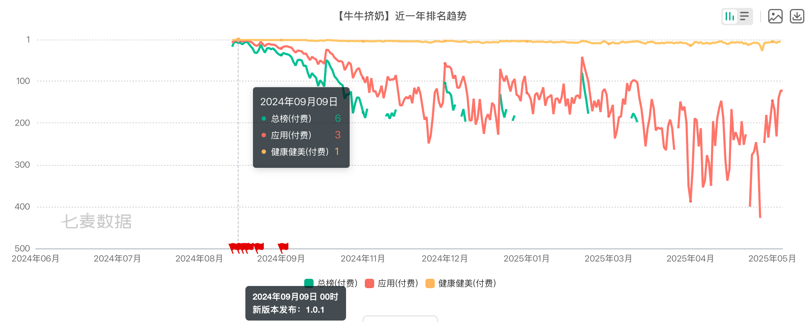
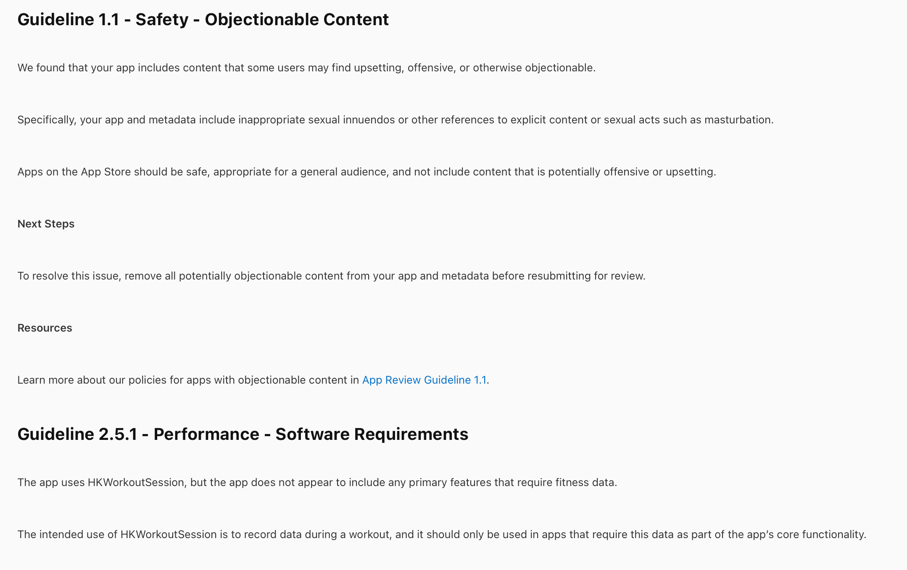

# 项目介绍
“牛牛挤奶”是我在[App Store](https://apps.apple.com/us/app/牛牛挤奶/id6670338827)中发布的第一款App，一经发布后就获得了比较高的热度，成为了一个现象级应用。
应用一度飙升到国区付费榜前三名：

# 灵感来源
好多人问我是如何想起来开发这款APP的。其实这款APP的灵感来源于影视飓风的一期视频，指路->[商标被抢注？影视飓风认识多少个UP主？700万粉丝Q&A！](https://www.bilibili.com/video/BV1Uu4y1h7bd)。看完视频后一段时间内我就想，影视飓风开发了之后没上架成功，那么我是不是能在他们的基础上修改一下，然后成功上架App Store？后边发生的事情证明，我的想法是对的。

# 开发历程
## 立项
2024年8月，我使用暑假首月的兼职工资购入了一台m1版的Macbook Air，随后马不停蹄地就开始学习如何使用XCode和学习Swift、SwiftUI。学习期间，我和我的同学讨论了该怎么样给APP命名，一开始我想的是“玩玩牛牛”，后来经过和同学多番讨论过程中他无意中提到了“挤奶”这个词，我顿时感觉到很欣喜，于是一拍板，敲定下来了“牛牛挤奶这个名字。
## 开发
立项没几天后，按照跟上述这位同学的约定我去了洛阳找他玩。虽然我很期待这次行程，但让我更兴奋的是牛牛挤奶的开发工作。在洛阳的那3天里，我根本无心游玩和倾听同学对他的家乡——洛阳的介绍，每次去景点，我都盼望着能早点回酒店继续开发牛牛挤奶。经过那几天高效的开发，牛牛挤奶已经基本开发完成。
## 起色
2024年8月中旬，距离教资笔试还剩下一个月的时间，于是我开始每天往返县图书馆备考教资。有一天备考休息的间隙，我将牛牛挤奶的一些基本介绍和截图随手发到了小红书，关闭手机后我开始潜心复习。一小时后我拿起手机，发现通知数量变成了“99+”，其全部来源于小红书。我非常紧张，以为是哪天发的评论被“网暴”了，结果打开一看，原来是刚才发的小红书笔记火了，有人在评论区讨论这个APP的用法，还有人问我什么时候能上架。
实话说，一开始我是有上架的想法，但没有太强烈。随着评论区越来越多的人“求上架”，我开始渐渐了解起苹果App Store的上架流程。详细了解之后，发现每年¥688的开发者会费让我有点退缩，因为对于大学生来说，这些钱已经算是不小的一笔钱了，我可以用这些钱干很多事，比如和朋友出去吃几顿好吃的饭。
## 上架
自那之后，小红书笔记的热度越来越高，“上架”的呼声也越来越高，也很巧，临开学前几天，有几位亲戚听说我要去上学了，就给了一些路费，加起来正好是700元。于是我马不停蹄地开通了开发者账号。上架过程还算顺利。上架第一天获得了400左右的下载量，并随着我不断地更新与小红书运营，在头一个月内保持了相对较高的热度。
## 停更
好景不长，在提交了1.3.5版本后，被苹果审核发现了端倪：

那时因为我还准备开发其他APP并上架，为了保证开发者账号不被封禁，我就没继续跟苹果硬刚，牛牛挤奶上架版本也最终定格在了1.3.0。

# 项目使用说明
·如果你有设备支持，可以自行构建安装到Apple Watch上。当然也可以选择在[App Store](https://apps.apple.com/us/app/牛牛挤奶/id6670338827)中支持一下！
·这款APP是我接触Swift开发后的第一款APP，所以对于代码可能会出现一些“不尽人意”的地方，还请见谅！
·在遵守MIT开源协议的前提下，你可以自由修改、分发（比如你很勇敢的话，可以再上架），但是要保留版权声明和许可条款。欢迎大家集思广益，在原有的基础上开发出更新奇的功能！
